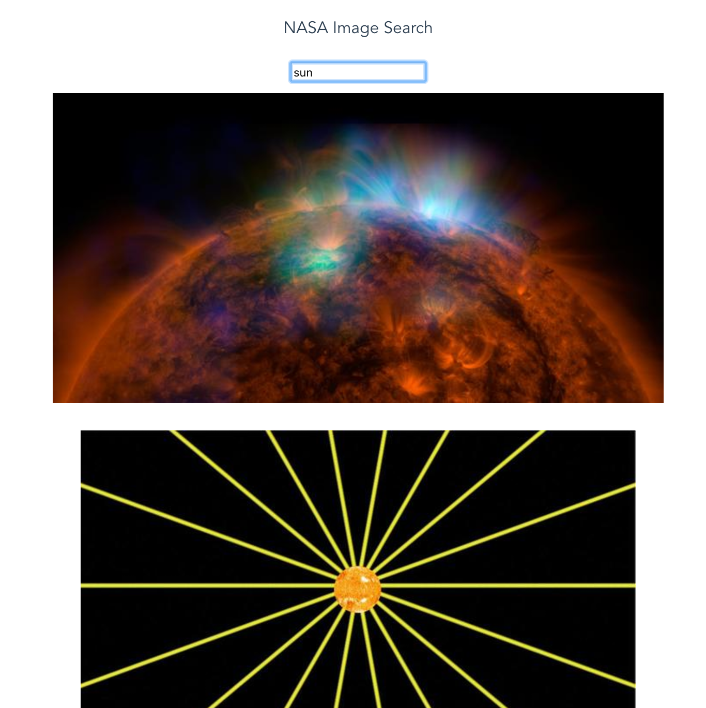

# search-nasa

> A Vue.js project live-coded at Facebook Live Session.



## Build Setup

``` bash
# install dependencies
npm install

# serve with hot reload at localhost:8080
npm run dev

# build for production with minification
npm run build

# build for production and view the bundle analyzer report
npm run build --report

# run unit tests
npm run unit

# run all tests
npm test
```

**Note:** You might run into a CORS issue while running the app. For demo purposes, you can use [this Chrome extension](https://chrome.google.com/webstore/detail/allow-control-allow-origi/nlfbmbojpeacfghkpbjhddihlkkiljbi?hl=en).

**Another note:** `vue-resource` has been deprecated since this demo was live-coded. If you'd like to incorporate API calls in your Vue app, use [axios](https://github.com/mzabriskie/axios).
